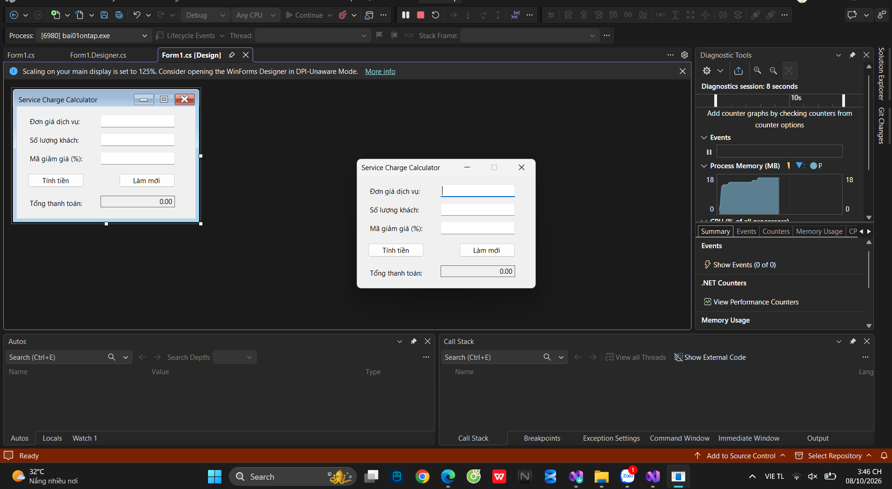
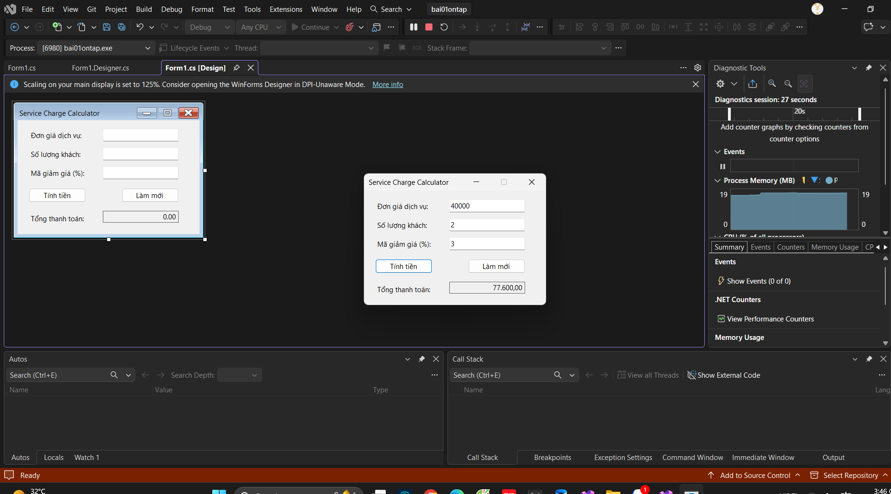
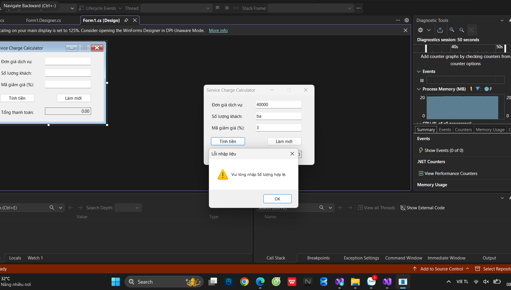

# BÁO CÁO BÀI TẬP / ĐỒ ÁN

## THÔNG TIN SINH VIÊN
- Họ và tên:Lê Quang Hưng
- Mã số sinh viên: 24810320237
- Lớp: d19qtanm1
- Tên môn học: lập trình net
- Tên bài tập: Bài 1

---

## KẾT QUẢ THỰC HÀNH

### 1. Ảnh màn hình Giao diện chính

### 2. Ảnh màn hình Chức năng thực thi / Kết quả

### 3. Ảnh màn hình Kiểm tra lỗi (Validation)
